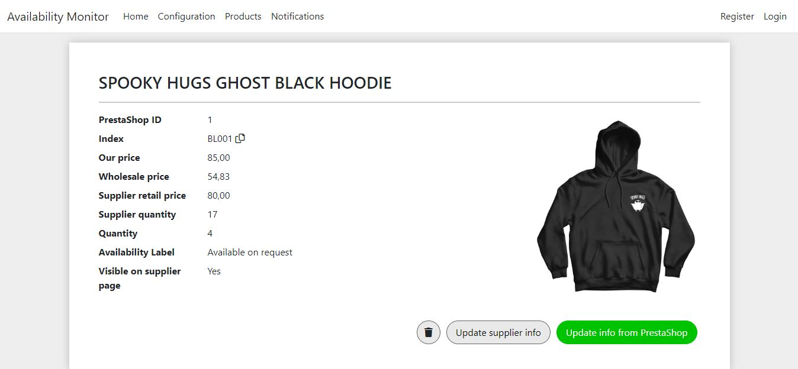

# Availability Monitor
## Table of contents
* [General info](#-general-info)
* [Live demo](#-live-demo)
* [Features](#-features)
* [How it works](#%EF%B8%8F-how-it-works)
* [Screenshots](#-screenshots) 
* [Future improvements](#-future-improvements)
* [Technologies](#-technologies-and-tools)

## 📄 General info
The app was created to monitor product stock and prices and change it on the website I am currently managing. It imports products from PrestaShop, then adds info about stock and prices based on the supplier XML file and notifies about any changes.

## 🌐 Live demo

## ✨ Features

* Importing products from your PrestaShop online store - no need to add them manually.
* Easily browse your products - sort and filter them as you need.
* Meaningful data charts - see the price and quantity for each product in past months.
* Notifications page - a quick insight into latest changes.

## ✔️ How it works

* Import your products from PrestaShop by just entering your shop URL and API key in the configuration tab.
* Enter the URL of the supplier XML file with your products (products will be matched by the product SKU).
* Now you can update supplier info when you want and see all the changes.

## 📷 Screenshots

### Updating supplier info

### Product list page

### Product details page

## 🔜 Future improvements
* Selecting multiple products from the list and making an action for each one (deleting or updating info).
* Filtering notifications.
* Ability to choose which columns should be displayed in products' list.
* Visual improvements (animations, effects).
* Better responsiveness.

## 💻 Technologies and tools

* .NET 6
* [Chart.js](https://www.chartjs.org/)
* [Firebase](https://firebase.google.com/)
* Visual Studio
* Azure
